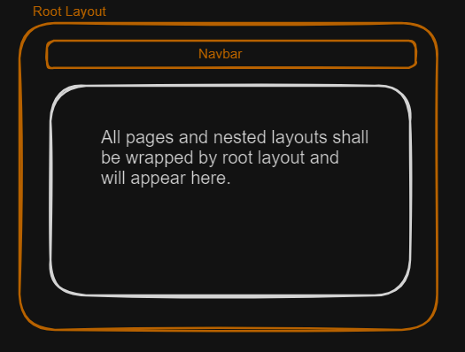
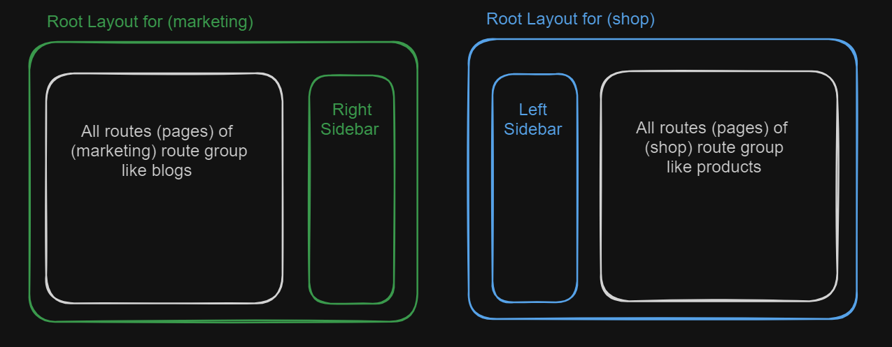

# Class 02 Part-II

## Route Groups

Route groups in Next.js allow you to organize your routes and project files into logical groups without affecting the URL path structure. By wrapping a folder name in parentheses, like `(folderName)`, you can create a route group that is not included in the route's URL path. This feature is particularly useful for creating multiple nested layouts or partitioning an application into sections with different UIs or experiences.

There are mutliple use cases of Route Groups.

### 1. Organizing routes and project files

For example, we are creating an App which includes blogs and a shop for selling different products. There would be some routes related to shop like products and in product routes we might want to add different categories of products. For blogs, we might have blogs of different categories like fashion, technology, finance etc. To better organize our project, we can use Route Groups and create two Route Groups. One for shop, and other for marketing. We will keep all shop related routes in Shop folder `(shop)` like so, and all blogs related routes in marketing folder `(marketing)` like so. Grouping like this would provide better manageability and organizatio of our project. Remember that these route groups won't become the part of our URL and we don't add `page.tsx` file in them.

### 2. Creating multiple nested layouts

#### RootLayout

Consider, we want Navbar to show on all our pages (routes) in whichever route group they are. For this, we'll create a `Navbar` component and add it in our root layout above `children`.

- check the example code

#### Nested Layout for (shop)

We also want that all our routes inside `(shop)` route group should have a left sidebar. To achieve this, we'll create a `layout.tsx` file inside `(shop)`, create a `Sidebar` component on left side with a little bit styling. Now all our routes (pages) inside `(shop)` will have a navbar on top and a sidebar on left.

- check the example code

#### Nested Layout for (marketing)

For our routes inside `(marketing)` route group, we want to add `Sidebar` on right side rather than left. To achieve this, we'll create a `layout.tsx` file inside `(marketing)`, add `Sidebar` component on right side with a little bit styling. Now all our routes (pages) inside `(marketing)` will have a navbar on top and a sidebar on right.
**_Inside nested layouts, we won't return `<html>` and `<body>` tags as we are already have a top-level root layout where we are returning these tags._**

- Check the example code

### 3. Creating multiple root layouts

For multiple root layouts, remove the top-level root-layout. Create one rootlayout for `(shop)` and other rootlayout for `(marketing)`. Both of these rootlayous should return `<html>` and `<body>` tags. For multiple rootlayouts, it has to be ensured that there is no route(page) above these. None of them is nested inside other (both are at same level). The homepage route `/` can be created inside anyone of route groups.
**_TODO: Create a project with this scenario._**

For multiple root layouts:

### 4. Opting specific segments into a layout

Read from documentation.

Read the nextjs documentation https://nextjs.org/docs/app/building-your-application/routing/route-groups
