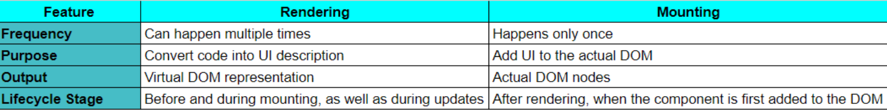

# React Basics

## Life Cycle of a component

1. User Request and Server-Side Rendering (SSR):

The user's browser sends a request to the Next.js server for a specific page.
Next.js determines whether to render the page on the server (Server-Side Rendering) or on the client (Client-Side Rendering). For the initial request, it's usually SSR.
**Server Components:**
Next.js renders the React components that are designated as Server Components on the server.
This results in HTML output that is sent back to the browser.
Server Components are never mounted on the client-side.
**Client Components (Hydration):**
The HTML for Client Components is also included in the server response, but it's marked for later hydration.
**\*Hydration** is the process where React attaches event handlers and other necessary logic to the pre-rendered HTML on the client-side, essentially making it interactive.\* 2. Client-Side Mounting and Initial Render:
The browser receives the HTML from the server and starts parsing and constructing the DOM tree.
**Client Components:**
React begins the mounting process for Client Components.
It creates component instances and calls their render methods to generate the initial UI representation.
React reconciles the pre-rendered HTML with the virtual DOM generated by the render method.
It updates the DOM with any differences and attaches event handlers.
The component is now considered mounted and fully interactive.

3. Component Updates (Re-Renders):

If the component's state or props change, React re-renders the component.
**Re-rendering:**
The render method is called again, producing a new virtual DOM representation.
React performs a "diffing" algorithm to compare the new virtual DOM with the previous one.
Only the parts of the DOM that have changed are updated efficiently.

4. Unmounting:

If the component is no longer needed (e.g., the user navigates away from the page), React unmounts it.
**Unmounting:**
The component's DOM nodes are removed from the page.

## Difference between Rendering and Mounting

**Rendering**

Process: Rendering is the process of converting a React component's code into the actual HTML elements that will be displayed in the browser.
Frequency: Rendering can happen multiple times throughout a component's lifecycle. It occurs whenever there's a change to the component's props or state, or when the parent component re-renders.
Types:
Initial Render: The first time a component is rendered.
Re-Render: Subsequent renders due to changes in props, state, or parent component.
Output: The output of rendering is a description of the component's UI (often a virtual DOM representation).
**Mounting**

Process: Mounting is the process of adding a component's rendered output to the actual DOM (Document Object Model) tree in the browser.
Frequency: Mounting happens only once in a component's lifecycle, the first time it's rendered.
Side Effects: Typically, side effects like fetching data, subscribing to events, or manipulating the DOM are performed during or after mounting.

